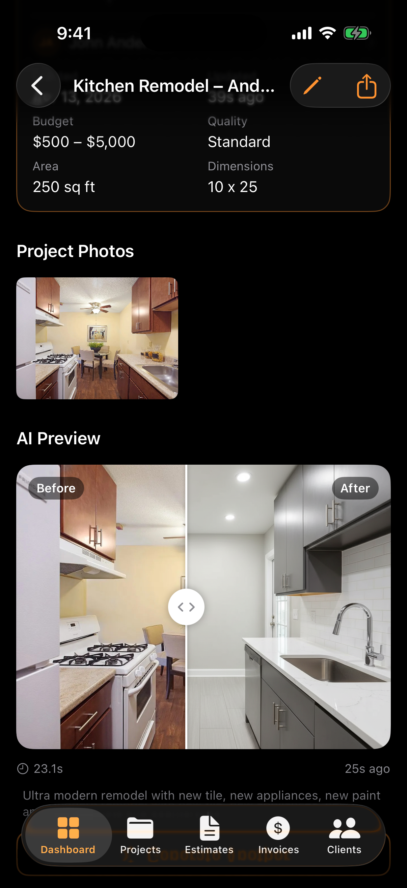
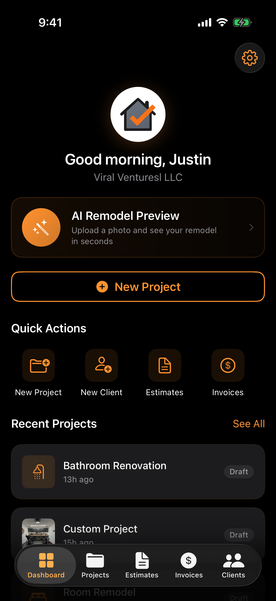
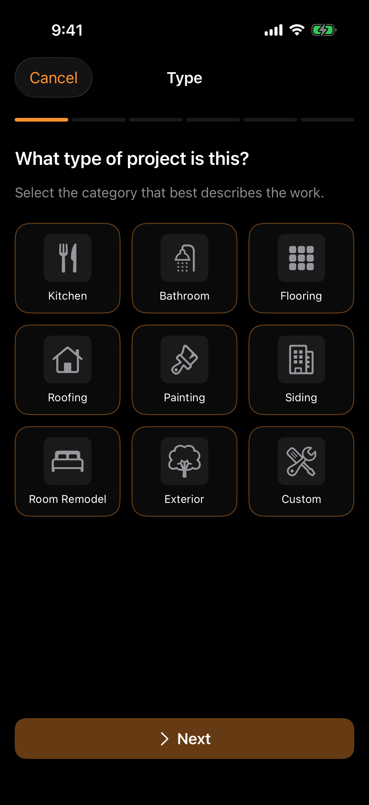
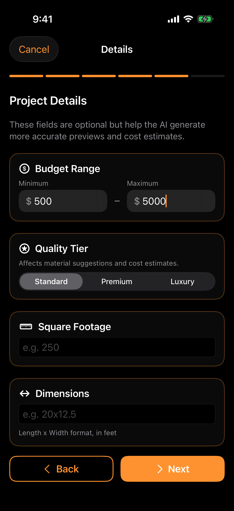
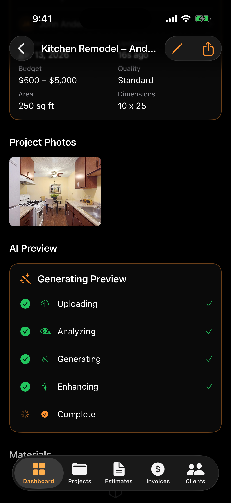
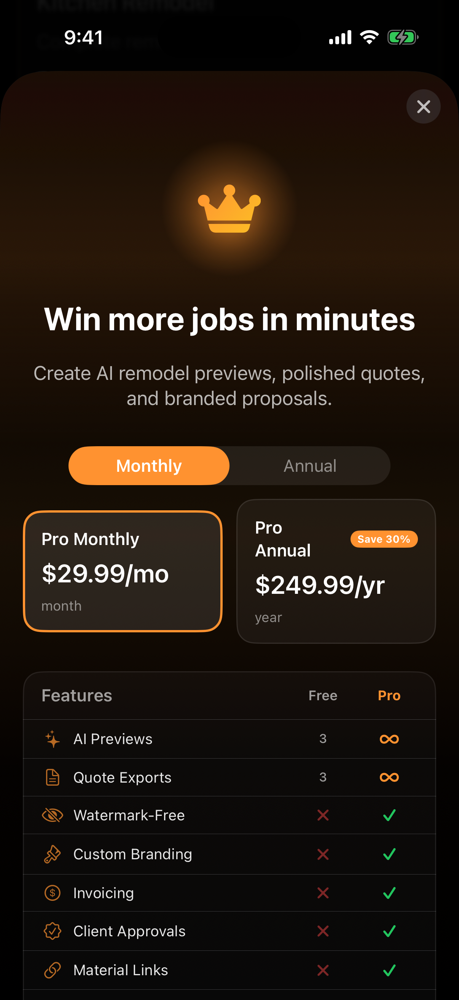

<div align="center">

# ProEstimate AI

**AI estimating and invoicing for contractors — photo to proposal in minutes.**

[](https://proestimateai.com)
[](https://swift.org)
[](https://nodejs.org)
[](https://www.typescriptlang.org)
[](./LICENSE)

<br />



<br /><br />

[Website](https://proestimateai.com) · [Architecture](#architecture) · [Getting started](#getting-started) · [Contributing](./CONTRIBUTING.md) · [Security](./SECURITY.md) · [License](./LICENSE)

</div>

---

## Overview

ProEstimate AI turns a single job-site photo into a fully costed estimate, branded proposal, and billable invoice — in the time it used to take to open a spreadsheet. A contractor uploads photos of a space, the app generates a photoreal AI remodel preview, auto-suggests materials and labor with quality tiers, and produces a sendable estimate. Approved estimates convert to invoices with one tap.

Built as a native iOS application with a TypeScript backend. Shipping on the App Store for iOS 26.4+. Backend runs on Railway with managed PostgreSQL and Redis.

## Product tour

<table>
  <tr>
    <td align="center" width="33%">
      
      <br /><sub><b>Dashboard</b><br />Quick actions, recent projects, and an AI-preview entry point.</sub>
    </td>
    <td align="center" width="33%">
      
      <br /><sub><b>Project types</b><br />Nine trade categories drive AI prompts and pricing defaults.</sub>
    </td>
    <td align="center" width="33%">
      
      <br /><sub><b>Smart defaults</b><br />Budget, quality tier, and dimensions sharpen the AI output.</sub>
    </td>
  </tr>
  <tr>
    <td align="center" width="33%">
      
      <br /><sub><b>Live generation</b><br />Four-stage pipeline with step-by-step feedback.</sub>
    </td>
    <td align="center" width="33%">
      
      <br /><sub><b>Before / after</b><br />Photoreal renders via Nano Banana Pro with a Gemini fallback.</sub>
    </td>
    <td align="center" width="33%">
      
      <br /><sub><b>StoreKit 2</b><br />Free credits, 7-day trial, monthly and annual tiers.</sub>
    </td>
  </tr>
</table>

## How it works

```
Photo upload  ->  AI remodel preview  ->  Material & labor suggestions
                                                     |
                                                     v
                      Estimate  ->  Proposal (shareable)  ->  Invoice
```

1. **Capture.** Contractor shoots one or more photos of the space on device. Assets upload to the backend and are stored as base64 in PostgreSQL with immutable cache headers.
2. **Generate.** The backend orchestrates image generation via PiAPI (Nano Banana Pro, then Nano Banana 2 as internal fallback) with a Google GenAI (Gemini 3.1 Flash Image) fallback if PiAPI is unavailable.
3. **Price.** Gemini 2.5 Flash produces line-item material and labor suggestions, scaled by the project's quality tier (Standard, Premium, or Luxury).
4. **Send.** The contractor reviews the auto-built estimate, sends a branded proposal with a shareable approval link, and converts the approved estimate into an invoice with tracking for partial payments and overdue balances.

## Feature highlights

<table>
  <tr>
    <td width="33%" valign="top">
      <b>AI-powered visuals</b><br />
      <sub>Photoreal before/after renders with configurable quality tiers. Provider abstraction selects the primary AI provider at runtime; fallbacks are transparent to the client.</sub>
    </td>
    <td width="33%" valign="top">
      <b>Structured estimates</b><br />
      <sub>Grouped material, labor, and other line items with per-item markup, taxation, discounts, and a DIY toggle that excludes labor for owner-operated jobs.</sub>
    </td>
    <td width="33%" valign="top">
      <b>Shareable proposals</b><br />
      <sub>Client-facing proposal pages with approval tokens. Marketing-site-hosted share links so clients do not need the app to respond.</sub>
    </td>
  </tr>
  <tr>
    <td valign="top">
      <b>Invoicing</b><br />
      <sub>Auto-number-incremented invoices from approved estimates with partial payments, overdue banners, and send/receive state machine.</sub>
    </td>
    <td valign="top">
      <b>StoreKit 2 commerce</b><br />
      <sub>Seven-day introductory trial, server-authoritative entitlement, atomic free-tier credit consumption, App Store purchase reconciliation, and refund-driven revocation.</sub>
    </td>
    <td valign="top">
      <b>Bilingual</b><br />
      <sub>Native Localizable.xcstrings catalogs in English and Spanish. All user-facing copy, including paywall, onboarding, and proposal-sharing flows.</sub>
    </td>
  </tr>
  <tr>
    <td valign="top">
      <b>Hardened auth</b><br />
      <sub>JWT access tokens with rotating refresh tokens, refresh-token reuse detection that revokes every session on the account, and Sign in with Apple.</sub>
    </td>
    <td valign="top">
      <b>Liquid Glass design</b><br />
      <sub>Apple&#39;s Liquid Glass language with a dark-first palette and <code>#FF9230</code> brand accent. Reusable design tokens and components across iOS.</sub>
    </td>
    <td valign="top">
      <b>iPad and iPhone</b><br />
      <sub>Responsive layouts adapt to iPad split view and large-canvas workflows, with native NavigationSplitView usage where appropriate.</sub>
    </td>
  </tr>
</table>

## Architecture

```
+---------------------------------------------------------------+
|  iOS App (SwiftUI, @Observable, Swift 6)                      |
|                                                               |
|  Views -> ViewModels -> Services -> APIClient -> URLSession   |
|                                         |                     |
|                                         v                     |
|              APIEndpoint enum (single source of truth)        |
|   JWT access/refresh, auto-retry on 401, PaywallError on 402  |
+---------------------------+-----------------------------------+
                            |  HTTPS JSON (snake_case)
                            v
+---------------------------------------------------------------+
|  Backend API (Express + TypeScript)                           |
|                                                               |
|  Router -> validate(Zod) -> Controller -> Service -> Prisma   |
|  sendSuccess / sendError envelope; AppError hierarchy         |
|  Rate limits, request IDs, Redis-backed counters              |
+---------------------------+-----------------------------------+
                            |
                            v
+---------------------------------------------------------------+
|  PostgreSQL (Railway)                                         |
|  Core domain + Commerce + Auth + Config tables                |
+---------------------------------------------------------------+
```

Key architectural decisions:

- Every HTTP response follows a strict envelope: `{ ok, data, meta }` for success, `{ ok: false, error }` for errors. Errors carry a `code`, `message`, and optional `field_errors` or `paywall` payload.
- Cursor-based pagination everywhere. No offset pagination.
- Refresh tokens rotate on every use. A detected reuse revokes every session for the user.
- Images are stored as base64 in PostgreSQL text columns and served as binary with immutable cache headers.
- Entitlements, usage credits, and feature flags are server-authoritative. The client mirrors them for UI responsiveness but never sources truth.
- Business logic lives exclusively in ViewModels (iOS) and services (backend). Views and controllers are thin.

## Tech stack

<table>
  <tr>
    <td><b>iOS</b></td>
    <td>
      Swift 6 &middot; SwiftUI &middot; @Observable &middot; SwiftData &middot; StoreKit 2 &middot; URLSession &middot; Xcode 26.4
    </td>
  </tr>
  <tr>
    <td><b>Backend</b></td>
    <td>
      Node.js 20+ &middot; TypeScript (strict) &middot; Express &middot; Zod &middot; Prisma &middot; PostgreSQL &middot; ioredis &middot; pino &middot; jose / jsonwebtoken &middot; bcryptjs &middot; Resend
    </td>
  </tr>
  <tr>
    <td><b>AI</b></td>
    <td>
      PiAPI Nano Banana Pro / Nano Banana 2 (primary image) &middot; Google GenAI Gemini 3.1 Flash Image (fallback) &middot; Gemini 2.5 Flash (material + labor estimation)
    </td>
  </tr>
  <tr>
    <td><b>Web</b></td>
    <td>
      Next.js 15 &middot; React 19 &middot; Tailwind 4 &middot; Three.js &middot; Framer Motion &middot; Vercel
    </td>
  </tr>
  <tr>
    <td><b>Infra</b></td>
    <td>
      Railway (API + PostgreSQL + Redis) &middot; Vercel (web) &middot; Docker &middot; GitHub Actions
    </td>
  </tr>
</table>

## Repository layout

```
.
+-- ProEstimate AI/              # iOS application sources (SwiftUI)
|   +-- App/                     # Entry point, router, global state, tabs
|   +-- Core/                    # Models, networking, persistence, utilities
|   +-- DesignSystem/            # Tokens, components, view extensions
|   +-- Features/                # Feature modules (Auth, Projects, Estimates, ...)
|   +-- Resources/               # Asset catalog, localized string catalogs
+-- ProEstimate AI.xcodeproj/    # Xcode project
+-- backend/                     # Node.js + TypeScript + Prisma API
|   +-- prisma/                  # Schema, migrations, seed
|   +-- src/
|   |   +-- app.ts               # Express composition
|   |   +-- index.ts             # Server entry point
|   |   +-- lib/                 # errors, envelope, jwt, hash, pagination
|   |   +-- middleware/          # auth, validate, requestId, rate-limit
|   |   +-- modules/             # Feature modules (route / ctrl / svc / dto / validators)
|   +-- Dockerfile
|   +-- railway.toml
+-- web/                         # Next.js marketing site
+-- .github/                     # CI, issue / PR templates, CODEOWNERS, assets
+-- .editorconfig
+-- .nvmrc
+-- CHANGELOG.md
+-- CONTRIBUTING.md
+-- LICENSE
+-- README.md
+-- SECURITY.md
```

## Getting started

### Prerequisites

- macOS with Xcode 26.4+ for iOS work
- Node.js 20+ — `nvm use` picks the pinned version from `.nvmrc`
- PostgreSQL 15+ (local install or Docker)
- Optional: Railway CLI for deployment, GitHub CLI for PR workflows

### iOS

```bash
open "ProEstimate AI.xcodeproj"
```

Bundle identifier: `Res.ProEstimate-AI` &middot; Deployment target: iOS 26.4.

Headless build:

```bash
xcodebuild \
  -project "ProEstimate AI.xcodeproj" \
  -scheme "ProEstimate AI" \
  -configuration Debug \
  -destination 'generic/platform=iOS Simulator' \
  build
```

### Backend

```bash
cd backend
cp .env.example .env              # populate DATABASE_URL, JWT secrets, AI keys
npm ci
npx prisma generate
npx prisma migrate dev
npm run dev                       # http://localhost:3000
```

| Command | Purpose |
| :------ | :------ |
| `npm run dev` | Nodemon dev server with hot reload |
| `npm run build` | Compile TypeScript into `dist/` |
| `npm start` | Run compiled server |
| `npm run prisma:studio` | Visual database browser |
| `npm run prisma:migrate` | Apply a new local migration |
| `npm run prisma:seed` | Seed the local database |

### Web

```bash
cd web
npm ci
npm run dev                       # http://localhost:3000
```

## Environment configuration

Backend variables (see `backend/.env.example`):

| Name | Required | Notes |
| :--- | :------- | :---- |
| `DATABASE_URL` | yes | PostgreSQL connection string |
| `JWT_SECRET` | yes | At least 32 characters, access-token signing |
| `JWT_REFRESH_SECRET` | yes | At least 32 characters, refresh-token signing |
| `PIAPI_API_KEY` | one of | PiAPI key for primary image generation |
| `GOOGLE_AI_API_KEY` | one of | Google GenAI key for fallback and materials |
| `GOOGLE_PLACES_API_KEY` | no | Address autocomplete |
| `REDIS_URL` | recommended | Distributed rate-limit counters; falls back to in-memory |
| `RESEND_API_KEY` | no | Transactional email |
| `NODE_ENV` | no | `development` / `production` |

At least one of `PIAPI_API_KEY` or `GOOGLE_AI_API_KEY` must be set.

## Engineering conventions

**iOS**
- `@Observable` for every stateful class. Never `ObservableObject` or `@Published`.
- Protocol-first services: `*ServiceProtocol: Sendable` with `Live*Service` and `Mock*Service` implementations. Default-parameter injection, no global container.
- Business logic lives in ViewModels. Views are declarative layout.
- Design tokens (`ColorTokens`, `SpacingTokens`, `TypographyTokens`, `RadiusTokens`) and shared components only. No hardcoded colors, fonts, radii, or spacing.
- Money is `Decimal`, not `Double`. Format with the shared `CurrencyText` view.
- Sheets driven by optional ids use `.sheet(item:)` with an `Identifiable` wrapper — `sheet(isPresented:) + if let id` has raced against us and is banned in new code.

**Backend**
- Strict TypeScript. No `any`. No unsafe casts at boundaries.
- Every module follows `route -> validator -> controller -> service -> dto`. No shortcuts.
- Every request body, query, and URL parameter validated with Zod via the shared `validate(schema, source)` middleware.
- Typed `AppError` subclasses only. Never raw `throw new Error(...)`.
- Multi-table writes run inside `prisma.$transaction` when atomicity matters.
- DTO functions are the single place Prisma models cross into API responses.
- snake_case on the wire, camelCase inside TypeScript.

**Cross-layer contract**

Changing one API endpoint touches five files in lockstep. A PR that changes fewer is almost always incomplete.

1. Backend: `route` + `validator` + `controller` + `service` + `dto`
2. iOS `APIEndpoint` enum case
3. iOS Decodable model matching the DTO shape
4. iOS service protocol method plus `LiveService` implementation
5. iOS ViewModel consuming the service

## Deployment

**Backend (Railway).** The Docker image runs `prisma migrate deploy && node dist/index.js` on boot, so pending migrations apply automatically on push.

```bash
cd backend
railway up --detach
railway variables --set "KEY=value"
railway logs
```

Health endpoint: `GET /health`.

**Web (Vercel).** The `web/` directory deploys to Vercel through the standard git integration. Build command: `next build`.

**iOS (App Store).** Archive from Xcode and submit through App Store Connect. TestFlight is the recommended pre-release channel.

## Contributing

Contributions are restricted to authorized team members. Standards, branch strategy, commit conventions, and review expectations are documented in [CONTRIBUTING.md](./CONTRIBUTING.md).

## Security

Do not file public issues for suspected vulnerabilities. Private disclosure instructions are in [SECURITY.md](./SECURITY.md).

## License

Copyright &copy; 2026 Viral Ventures LLC. All Rights Reserved.

ProEstimate AI is a product of Viral Ventures LLC (Minnesota, United States). The software is proprietary; unauthorized copying, modification, distribution, or use is strictly prohibited. Full terms in [LICENSE](./LICENSE).

## Contact

| Purpose | Address |
| :------ | :------ |
| Licensing, partnerships, legal | [legal@proestimateai.com](mailto:legal@proestimateai.com) |
| Security disclosures | [security@proestimateai.com](mailto:security@proestimateai.com) |
| Customer support | [support@proestimateai.com](mailto:support@proestimateai.com) |
| Privacy | [privacy@proestimateai.com](mailto:privacy@proestimateai.com) |
| Website | [proestimateai.com](https://proestimateai.com) |

<div align="center">
<sub>Built by Viral Ventures LLC &middot; Minnesota, USA</sub>
</div>
